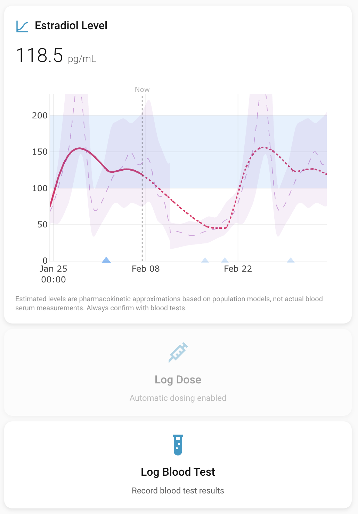

# Estrannaise HRT Monitor



A Home Assistant custom integration for tracking estradiol levels using pharmacokinetic modeling. Based on [estrannaise.js](https://github.com/WHSAH/estrannaise.js).

All data is stored locally in a SQLite database and never touches the network.

## What it does

Estrannaise estimates your blood estradiol (E2) levels over time using a three-compartment pharmacokinetic model. You configure your dosing regimen (ester, method, dose, interval), and it renders a Plotly chart showing past levels and future predictions. Blood test results can be logged to calibrate the model to your individual response.

Multiple dosing regimens can be configured as separate integration entries and their contributions are summed additively on a single chart.

## Supported esters and methods

| Ester | Methods |
|---|---|
| Estradiol Benzoate | Intramuscular, Subcutaneous |
| Estradiol Valerate | Intramuscular, Subcutaneous |
| Estradiol Enanthate | Intramuscular, Subcutaneous |
| Estradiol Cypionate | Intramuscular, Subcutaneous |
| Estradiol Undecylate | Intramuscular, Subcutaneous |
| Estradiol (base) | Transdermal Patch, Oral |

Subcutaneous injections for EB, EV, EEn, and EC use the same PK model as intramuscular, as published studies show virtually identical pharmacokinetics between the two routes for oil-based depot injections. Estradiol Undecylate subcutaneous has its own community-derived model parameters.

Oral micronized estradiol is modeled using the same three-compartment framework with parameters calibrated to match published clinical data (Kuhnz 1993, Femtrace FDA review). The absorption rate constant is set very large (k1=100 day⁻¹) so the model effectively reduces to a Bateman (1-compartment absorption-elimination) curve. Oral dosing is only available for plain Estradiol, not esterified forms.

## Installation

### HACS (Recommended)

[](https://my.home-assistant.io/redirect/hacs_repository/?owner=PersephoneKarnstein&repository=ha-estrannaise)

### Manual

1. Copy `custom_components/estrannaise/` into your Home Assistant `custom_components/` directory.

2. Restart Home Assistant.

3. Go to **Settings > Devices & Services > Add Integration** and search for **Estrannaise HRT Monitor**.

4. Follow the config flow to set up your dosing regimen. Three setup modes are available:
   - **Guided** — a beginner-friendly wizard that asks method-specific questions (pill dose, injection volume, patch strength, etc.) and computes the regimen for you
   - **Manual** — enter ester, method, dose, and interval directly
   - **Auto-generate (beta)** — targets a trough of ~200 pg/mL or approximates a natural menstrual cycle using NNLS cycle fitting

   All modes then ask for tracking mode (Manual / Automatic / Both), dose time of day, units (pg/mL or pmol/L), and optional calendar integration.

5. Add the Lovelace cards to your dashboard (see below).

## Dashboard cards

### Estradiol Level chart

```yaml
type: custom:estrannaise-card
entity: sensor.estrannaise_estradiol_enanthate
title: Estradiol Level
days_to_show: 30
days_to_predict: 7
show_target_range: true
show_danger_threshold: false
show_menstrual_cycle: false
line_color: '#E91E63'
```

Card editor options:
- **Entity**: The Estrannaise sensor entity
- **Title / Icon**: Customize the card header
- **Days to show / predict**: How far back and forward to render
- **Show target range**: Blue band at 100-200 pg/mL
- **Show danger threshold**: Red band above 500 pg/mL
- **Show menstrual cycle overlay**: Reference menstrual cycle E2 curve (p5-p95 band)
- **Show dose markers**: Toggle dose chevrons and spike lines on/off (default: on)
- **Line / prediction color**: Customize the trace colors

The chart displays:
- Solid line for past estimated levels, dotted for future predictions
- Confidence bands based on PK model variance
- Dose chevrons at the bottom (hover near one to see a spike line with dose info)
- Blood test markers (red dots)
- "Now" vertical line separating past from prediction
- Coincident doses of the same ester are merged and shown as a combined amount

### Log Dose button

```yaml
type: custom:estrannaise-dose-button
entity: sensor.estrannaise_estradiol_enanthate
```

Opens a dialog to select the ester and dose amount before logging. The dropdown is populated from all configured regimens. Optional card config overrides:
- **model**: Default ester pre-selected in the dialog (e.g., `EEn im`, `E oral`)
- **dose_mg**: Default dose amount

Shows "Automatic dosing enabled" if tracking mode is set to Automatic.

### Log Blood Test button

```yaml
type: custom:estrannaise-test-button
entity: sensor.estrannaise_estradiol_enanthate
```

Opens a dialog to record blood test results (level in pg/mL). The model uses blood tests to compute a scaling factor that adjusts predictions to match your individual pharmacokinetics.

## Multiple regimens

You can add multiple integration entries (e.g., 3mg EEn every 7 days + 10mg EEn every 28 days). Each entry's doses are aggregated additively on the same chart. When doses from different regimens coincide (within 1 hour, same ester), they appear as a single merged chevron and calendar event showing the combined dose.

## Auto-generate mode (beta)

When choosing "Auto-generate" during setup, you can target:
- **Target range**: Computes a single dose/interval to maintain a trough around 200 pg/mL
- **Menstrual range**: Uses NNLS cycle fitting to find up to 4 dose schedules that approximate the estradiol curve of a natural menstrual cycle (~100 pg/mL average). Each schedule becomes a separate integration entry.

This mode is marked beta — it works well for most ester/method combinations but the computed regimens should be reviewed with your healthcare provider.

## Backfill

When using Automatic or Both tracking mode, the integration can backfill up to 90 days of past scheduled doses so the chart shows a complete history from the first render. The guided setup asks "Have you been on this schedule for a while?" — answering yes enables backfill. It can also be toggled via the integration's options flow.

## Calendar integration

When enabled, scheduled doses appear as events on your Home Assistant calendar. Coincident same-ester doses are merged into single events.

## Services

| Service | Description |
|---|---|
| `estrannaise.log_dose` | Record a dose (entity, model key, dose_mg, optional timestamp) |
| `estrannaise.log_blood_test` | Record a blood test (entity, level_pg_ml, optional timestamp/notes) |
| `estrannaise.delete_dose` | Remove a dose by its database ID |
| `estrannaise.delete_blood_test` | Remove a blood test by its database ID |
| `estrannaise.clear_data` | Delete all saved doses and blood tests (irreversible) |

## How the PK model works

The integration uses a three-compartment pharmacokinetic model from [estrannaise.js](https://github.com/WHSAH/estrannaise.js), with parameters estimated via MAP estimation and MCMC in Esterlabe.jl (unreleased). For each dose, the blood E2 contribution at time $t$ (days after dosing) is:

$$E_2(t) = \frac{d ~ k_2 ~ k_3}{(k_1 - k_2)(k_1 - k_3)} \left( k_1 ~ e^{-k_1 t} - k_2 ~ e^{-k_2 t} - k_3 ~ e^{-k_3 t} \right)$$

where $d$, $k_1$, $k_2$, $k_3$ are ester/method-specific parameters. The total $E_2$ at any time is the sum of contributions from all past doses across all configured regimens.

Transdermal patches use the same three-compartment model, extended with a wear duration: the patch delivers a constant input during wear, then the residual compartments decay after removal. Patch PK parameters are calibrated for mcg/day input (e.g., a 100 mcg/day patch passes 100 to the model, not 0.1 mg).

Blood test calibration computes an exponentially-weighted average scaling factor (recent tests weighted more), clamped between 0 and 2, so predictions gradually align with your measured levels.

## Privacy

All data stays local. The SQLite database is stored at `<ha_config>/estrannaise.db`. Plotly.js is bundled locally (no CDN). No network requests are made.

## Credits

- PK model and parameters: [estrannaise.js](https://github.com/WHSAH/estrannaise.js) by WHSAH
- Monotherapy dose guidelines: [A Practical Guide To Feminizing Hrt](https://pghrt.diy/) by Katie Tightpussy
- Charting: [Plotly.js](https://plotly.com/javascript/) (bundled)
